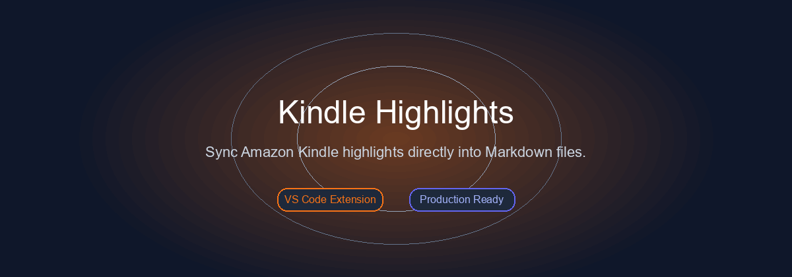
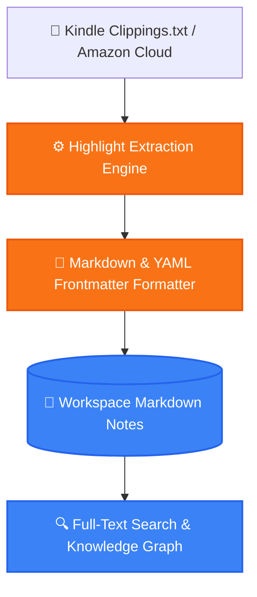

<p align="center">
  
</p>

<h1 align="center">📚 Kindle Highlights — VS Code Sync & Note Manager</h1>

<p align="center">
  <strong>Sync Amazon Kindle highlights, annotations, and clippings directly into your VS Code workspace as clean, structured Markdown files.</strong>
</p>

<p align="center">
  <a href="#-features">Features</a> •
  <a href="#-architecture">Architecture</a> •
  <a href="#-quick-start">Quick Start</a> •
  <a href="#-project-structure">Structure</a> •
  <a href="#-license">License</a>
</p>

<p align="center">
     
</p>

---

## ✨ Features (Key Outcomes & Capabilities)

| Icon | Feature | Outcome & Real Proof |
| :---: | :--- | :--- |
| 📥 | **Clippings & Amazon Cloud Sync** | Parse local `My Clippings.txt` or sync directly with your Amazon Kindle digital notebook |
| 📄 | **Structured Markdown Generation** | Generates individual book notes with YAML frontmatter, authors, highlights, and page citations |
| 🔄 | **Idempotent Smart Sync** | Merges newly created highlights without overwriting your manual edits or annotations |
| 🔍 | **Obsidian & Foam Compatible** | 100% interoperable with Obsidian, Foam, and Logseq knowledge bases |

---

## 📊 Architecture & Flow



---

## 📁 Project Structure

```bash
kindle-highlights/
├── 📁 src/                    # Extension core & scraping engine
├── 📁 media/                  # Webview UI & icons
├── 📄 package.json            # Extension manifest
└── 📄 README.md               # Extension documentation
```

---

## 🚀 Quick Start

### Prerequisites
- Check language runtimes (Python / Node.js) and system dependencies.

```bash
# Install from Marketplace:
ext install LoNebula9.kindle-highlights

# Or clone and test:
git clone https://github.com/LoNebula/kindle-highlights.git
npm install
npm run compile
```

---

## 💡 Usage Notes & Tips

> [!TIP]
> Ensure all required environment variables and dependencies are properly configured before execution.

---

<p align="center">
  Released under the <a href="LICENSE">MIT License</a>. Made with ❤️ by <a href="https://github.com/LoNebula">LoNebula</a>
</p>
