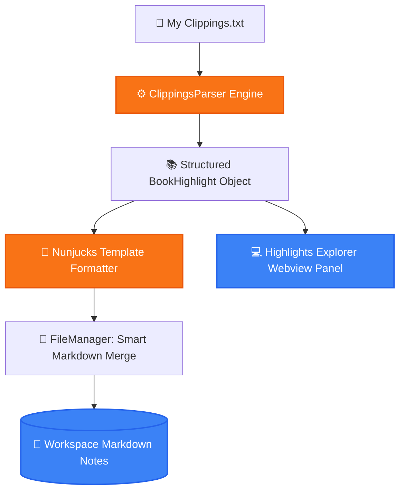

<p align="center">
  
</p>

<h1 align="center">📚 Kindle Highlights — VS Code Sync & Note Manager</h1>

<p align="center">
  <strong>Sync Amazon Kindle Highlights into Workspace Markdown Files with Customizable Nunjucks Templates.</strong>
</p>

<p align="center">
  <a href="#-overview">Overview</a> •
  <a href="#-features">Features</a> •
  <a href="#-code-architecture">Code Architecture</a> •
  <a href="#-system-flow">System Flow</a> •
  <a href="#-project-structure">Structure</a> •
  <a href="#-quick-start">Quick Start</a> •
  <a href="#-license">License</a>
</p>

<p align="center">
     
</p>

---

## 📌 Overview

A feature-rich VS Code extension (`LoNebula9.kindle-highlights`) inspired by the Obsidian Kindle Plugin. It parses your Kindle device's `My Clippings.txt` file or Amazon Cloud Notebook, extracts highlights, annotations, and bookmarks, and formats them into structured Markdown files using customizable Nunjucks templates.

---

## ✨ Features (Key Outcomes & Capabilities)

| Icon | Feature | Outcome & Real Proof |
| :---: | :--- | :--- |
| 📥 | **My Clippings.txt Parser** | Extracts highlights, notes, locations, and timestamps from any Kindle device file |
| 📄 | **Custom Nunjucks Templates** | Full control over Markdown structure, frontmatter metadata, and citation layout |
| 🔄 | **Smart Idempotent Merge** | Appends new highlights without erasing your personal annotations or edits |
| 🎨 | **Interactive Webview UI** | Browse books and highlights with dedicated search and filter panels |

---

## 🔬 Code Architecture & Implementation

### 🔬 Code Implementation (`src/`)
- **`clippingsParser.ts`**: Regular expression parser for multilingual Kindle clippings format (`==========` delimiter, Title (Author), Location/Page, Timestamp, Highlight Text).
- **`fileManager.ts`**: Handles idempotent Markdown file generation, creating one file per book with YAML frontmatter and merging new highlights without overwriting user notes.
- **`templateEditorPanel.ts`**: Interactive Webview panel for customizing Nunjucks templates (`{{title}}`, `{{author}}`, ``).
- **`highlightsPanel.ts`**: Visual book shelf and highlight explorer inside VS Code.

---

## 📊 System Flow



---

## 📁 Project Structure

```bash
kindle-highlights/
├── 📁 assets/                 # Marketplace PNG hero banners
│   └── 🎨 hero.png
├── 📁 src/
│   ├── 📄 clippingsParser.ts  # Kindle clippings regex parsing engine
│   ├── 📄 fileManager.ts      # Markdown generation & smart merge
│   ├── 📄 templateEditorPanel.ts # Nunjucks template editor webview
│   └── 📄 extension.ts        # Main commands & lifecycle
├── 📄 package.json            # Extension manifest
└── 📄 README.md               # Documentation
```

---

## 🚀 Quick Start

```bash
# Install from Marketplace:
ext install LoNebula9.kindle-highlights

# Or build locally:
npm install
npm run compile
```

---

<p align="center">
  Released under the <a href="LICENSE">MIT License</a>. Crafted with precision by <a href="https://github.com/LoNebula">LoNebula</a>
</p>
